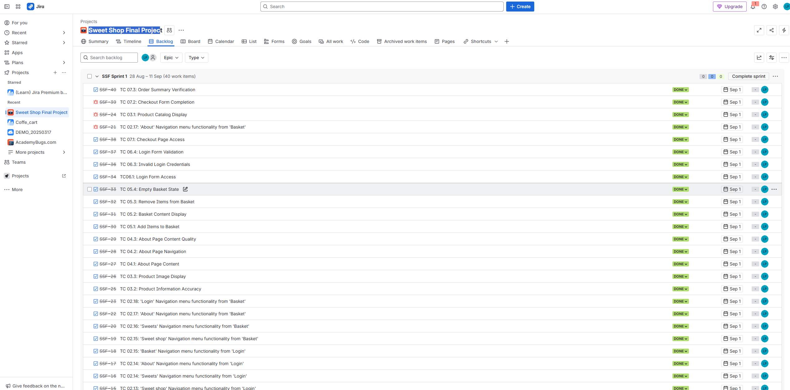
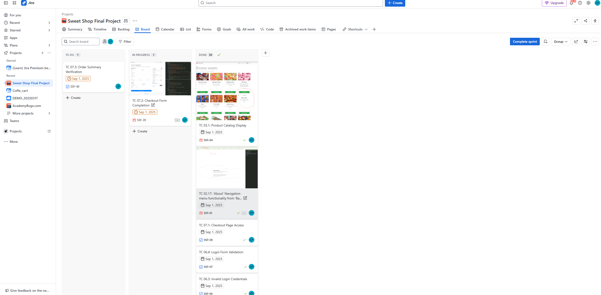
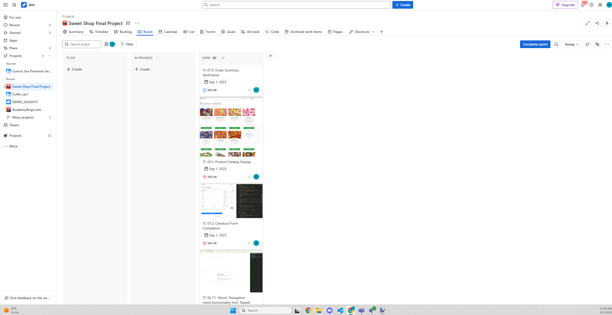

# Working Process with Jira Board Sweet Shop final project

## Overview

This document outlines the workflow used in the SS board (Sweet Shop Final Project) within Jira. It includes managing the backlog, sprint planning, task assignment, progress tracking and complection monitoring.

## 1. Backlog Management

The Backlog section contains all test cases (TCs) organized by Sprint (e.g., SSF Sprint 1).
```
Each task follow a consistent nameing convention:
TC < test scenario number>.<test cases number> <Test case tittle>
```
Each test case includes:
- A clear description
- Pre-requisites
- Steps to execute
- Expected results

## 2. Task Details

Clicking on the task

- A detailed test cas description
- Assignee field (can be assigned manually)
- Reporte information
- Development option (e.g. create branch/commit)
- Due date (e.g. Sep. 1, 2025)
- Sprint assignment (e.g. SSF Sprint 1)



## 3. Sprint Workflow

## Columns in the Active Sprint Board:

- To Do - tasks not yet started
- In Progress - tasks currently being worked on
- Done - completed task with test cases executed and result verified


## Sprint Example:



## 4. Complection Tracking

- After task execution and validation cards are moved to Done column
- The board visually reflects real-time progress
- Sprint can be completed once all task are moved to Done
  
  


## 5. Best Practices

- Always assign tasks to reveland team members
- Update task status promtly
- Use consistent naming for test cases
- Ensure test description are clear and reproducible
- Regularly review the board during daily stand-ups


## Summary
This Jira workflows ensures structured and efficieen tracking of the test cases for Sweet Shop Final Project. By following this process maintain clarity, acountability and quality throughout the sprint lifecycle.